Are you tired of configuring a database all by yourself and want to code what matters? Then this is for you!

This tutorial will be based off my talk with Kotlin Belfast User Group, feel free to watch that talk too!

<iframe width="560" height="315" src="https://www.youtube.com/embed/GV0rTcWGaR4" frameborder="0" allow="accelerometer; autoplay; clipboard-write; encrypted-media; gyroscope; picture-in-picture" allowfullscreen></iframe>

## Introduction

Ktor is a lightweight framework developed by Jetbrains. It enables you to build small microservices with less lines of code and makes it fun!

In this tutorial, I'll be showing how to build a RESTful API with Ktor and MongoDB Altas. MongoDB Altas is a database as a service that is hosted on the cloud. Think of this that your database is hosted on somebody else's computer. 

We'll be creating a Conference Management dashboard where can we can read, add, remove and update conferences. 

Sounds interesting? Let's dive into it!

## Prerequisites for MongoDB Altas
Let's start setting up our MongoDB database using Altas. Head to the [Altas site](https://www.mongodb.com/cloud/atlas) and register an account there.

Firstly, we need to create a project as shown below:

<p align="center">
    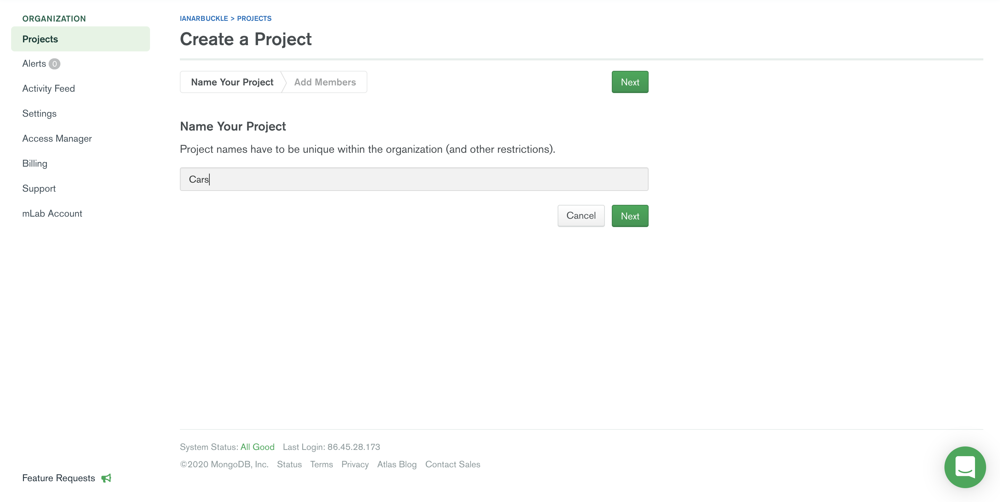
</p>

We can keep the defaults for permissions for this tutorial and just hit "Create Project" as shown below:

<p align="center">
    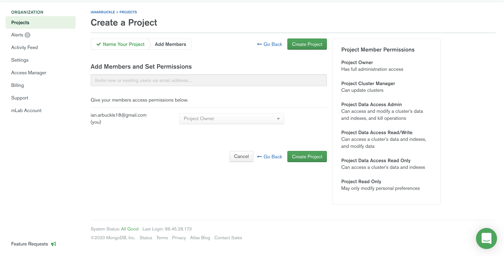
</p>

Once you've built your project, we can starting creating our cluster!

Before we begin, a cluster in a nutshell is a shared cluster that will allow us to scale read and writes along several nodes. Instead of going into detail, I'd recommend checking out the official [documentation](https://docs.mongodb.com/v3.0/core/sharding-introduction) on sharding.

<p align="center">
    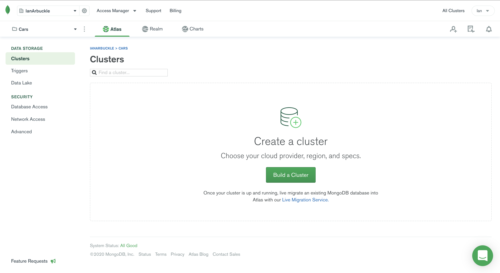
</p>

We are going to use the free cluster for this tutorial. So, we don't have to spend any money ;)

<p align="center">
    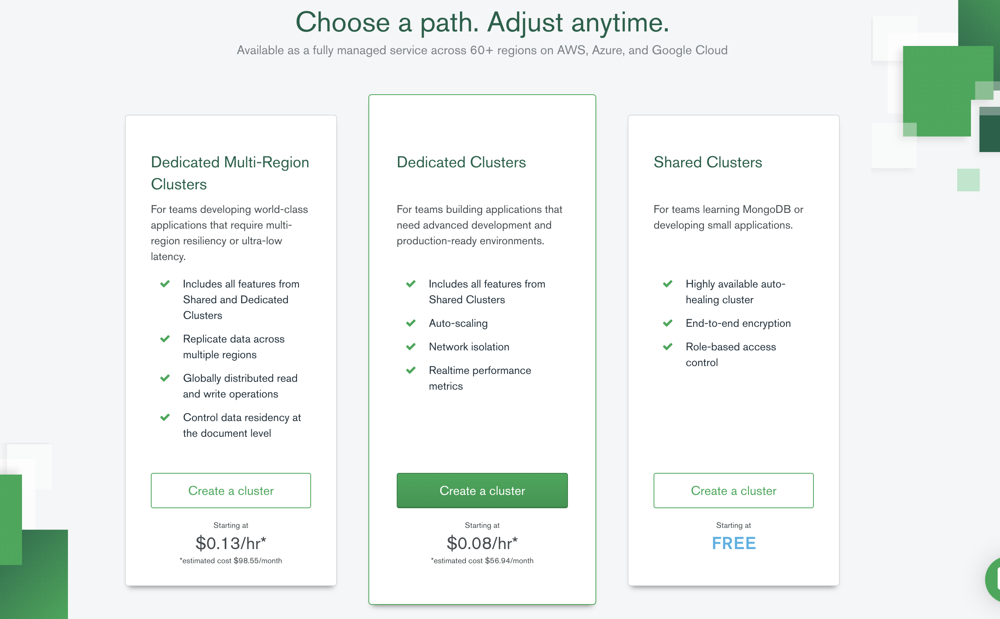
</p>

Once we've done that, we now have a few options to how we can configure our cluster. We can choose a cloud provider such as; AWS, Azure and Google Cloud. For this tutorial, we will be using the most popular provider, AWS.

As shown below, make sure you hit AWS and choose your replica zone. I'll be using the eu-west-1 zone but you should pick the region that is the closest to you.

<p align="center">
    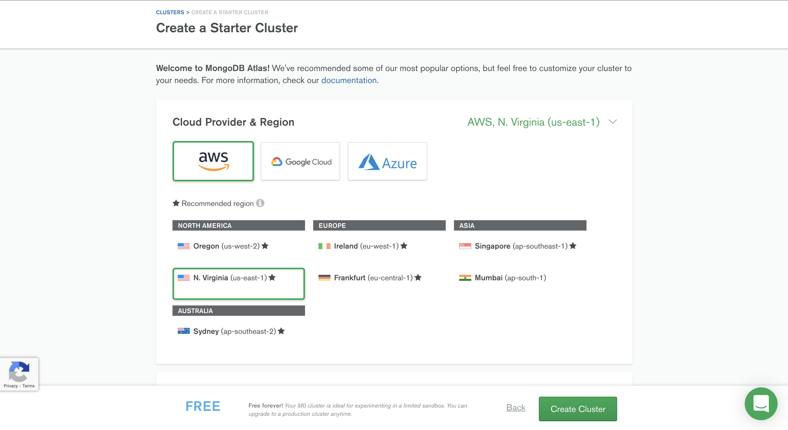
</p>

Now, we are going to create our cluster. For this tutorial, we will be using the free tier sandbox cluster as shown below:

<p align="center">
    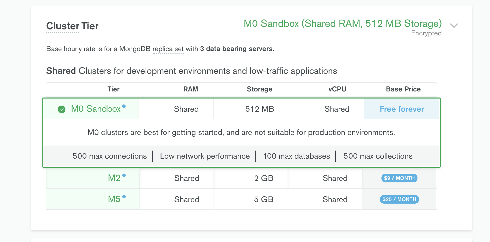
</p>

Then we can give our cluster a name shown below:

<p align="center">
    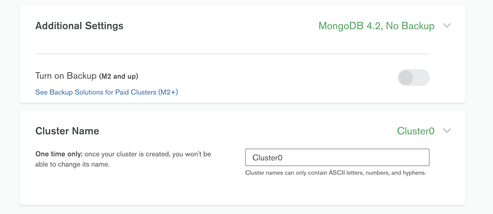
</p>

Now we can wait for Altas to build our environments for us.

<p align="center">
    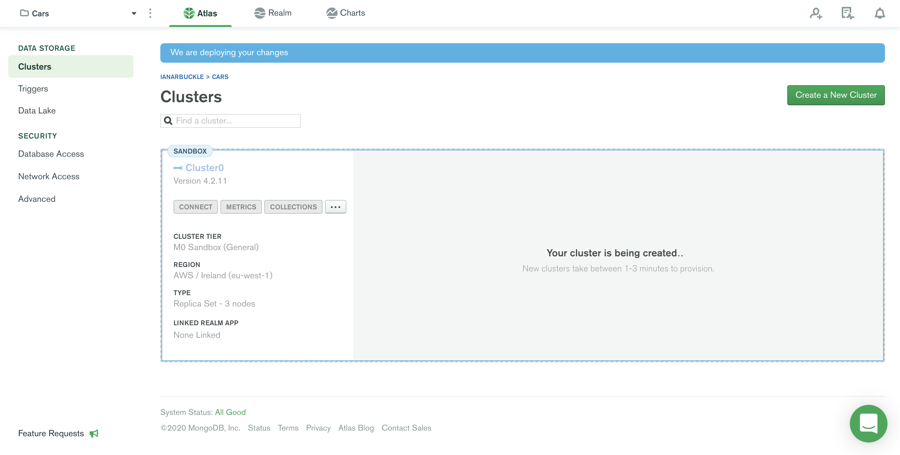
</p>

Done? Great! Now we'll stop here and setup our Ktor app.


## Prerequisites for Ktor app

I'll be using IntelliJ by Jetbrains for this tutorial and I'd suggest you install it. 

Firstly, we can create our Ktor app by creating a new project shown below:

By time of writing, I'm using Ktor 1.4.3. 

<p align="center">
    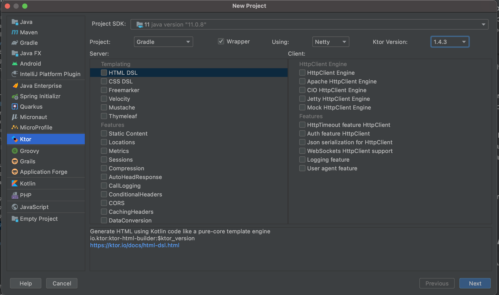
</p>

Then you can create your project name and hit finish.

Once you've finished syncing your project, let's head to the ```build.gradle``` and add the following dependencies:

````kotlin
dependencies {
    implementation("org.jetbrains.kotlin:kotlin-stdlib-jdk8:$kotlin_version")
    implementation("io.ktor:ktor-server-netty:$ktor_version")
    implementation("ch.qos.logback:logback-classic:$logback_version")
    implementation("io.ktor:ktor-jackson:$ktor_version")

    //MongoDB wrapper library
    implementation("org.litote.kmongo:kmongo-coroutine:$kmongo_version")
    implementation("org.jetbrains.kotlinx:kotlinx-coroutines-test:$coroutines_version")

    //Koin for dependency injection
    implementation("org.koin:koin-ktor:$koin_version")
    implementation("org.koin:koin-core:$koin_version")

    testImplementation("io.ktor:ktor-server-test-host:$ktor_version")
    testImplementation("io.mockk:mockk:$mockk_version")
}
````

Now we are ready to start building our Ktor RESTful app.

## App architecture and setting our environment 
The advantage of Ktor is the freedom to choose whatever architecture fits our use case. For this tutorial, I'll be going for the Spring MVC architecture that is commonly used in Spring Boot. 

Our project skeleton will look something like this:

<p align="center">
    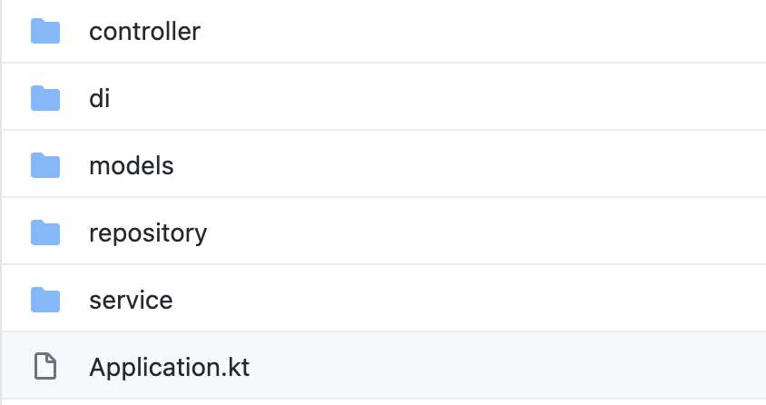
</p>

Let's take a look at our ``application.conf`` file and this is where can add configurations for our Ktor application. We can define the port and create environment variables here too. We are going to add an environment variable for our mongo uri that we will use to connect our database.

```kotlin
ktor {
    deployment {
        port = 8080
        watch = [ com.tutorial.conferencesapi.ApplicationKt.module ]
    }
    application {
        modules = [ com.ianarbuckle.conferencesapi.ApplicationKt.module ]
    }
    mongoUri = ${MONGO_URI}
}
```

In order to get our Mongo uri we can retrieve this from the MongoDB Altas project we've setup. 

Hit the "connect" button in the cluster sandbox:

<p align="center">
    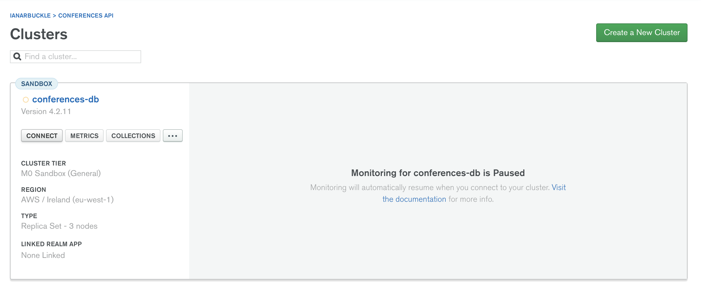
</p>

Then select the "Connect your application" option and you can copy the uri from there:

<p align="center">
    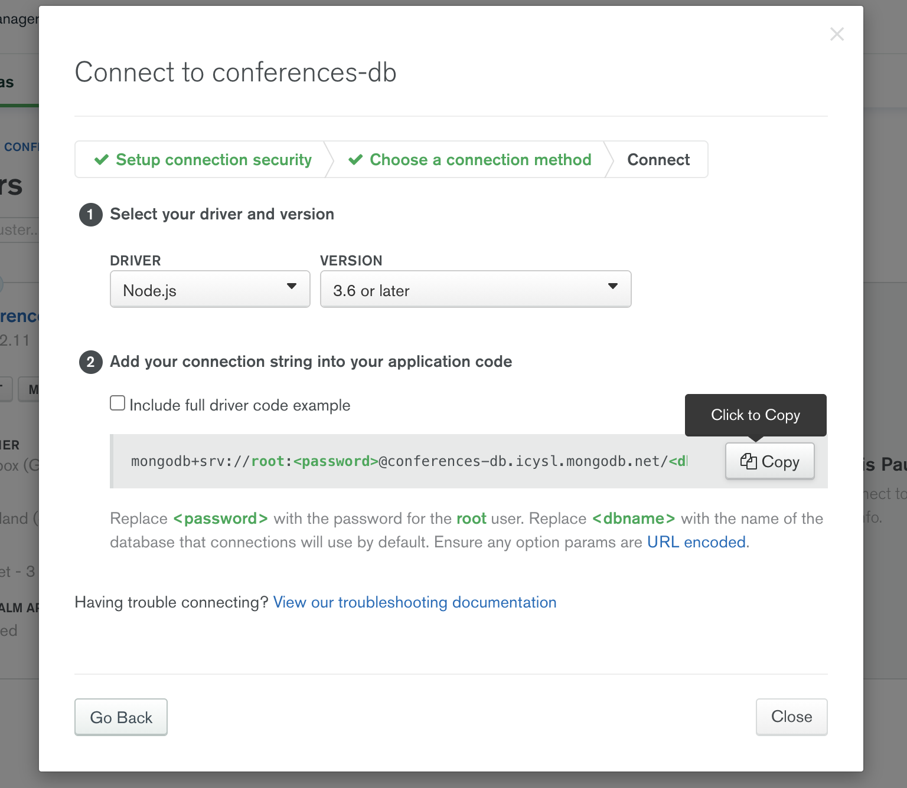
</p>

Now copy that and we need to replace the ```<dbname>``` and ``<password>`` placeholders. 

For our ```<dbname>``` let's change it to ```conferences``` and I'll let you decide what password you wish to use.

Inside our ```Application.kt``` class we need to create a function to run our app and in this we will be using a Netty embedded server as follows:

```kotlin
fun main(args: Array<String>) {
    embeddedServer(Netty, commandLineEnvironment(args)).start(wait = true)
}
```

Now, we define our application module. Just to note, we can have multiple modules and if you look inside the application.conf file above you'll see we can add multiple modules for our application inside the modules array. In our case, we are going to keep things simple for this tutorial and have a single module.


````kotlin
    fun Application.module(testing: Boolean = false) {
        
    }
````

If you run the app now, you'll notice it isn't useful :) Let's go ahead and create a few "features". Features in Ktor work exactly like plugins where it can install functionality for you. In our app, we are going to add the following:

* <strong>Default Headers</strong> <br/>
We will be installing a feature to add a set of default headers to our HTTP responses. It will add a date and server header to each response.

* <strong>Content Negotiation</strong> <br/>
We want to be able to communicate with our API via Json and we need to decide what content type to be used. In order to do that, we need to add a content negotiation. In this tutorial, we will be using the Jackson converter.

* <strong>CORS</strong> <br/>
Since we will be serving public content, it is good practice for our API to handle support for CORS.

>Cross-Origin Resource Sharing (CORS) is a specification that enables truly open access across domain-boundaries. If you serve public content, please consider using CORS to open it up for universal JavaScript / browser access.

<small>From [enable-cors.org](http://enable-cors.org/) </small>

* <strong>Koin</strong> <br/>
To make it easy to inject dependencies we'll be using Koin for its simplicity.

Let's install the features using the ```install()``` function which takes in an application feature type.

````kotlin
fun Application.module(testing: Boolean = false) {

    install(DefaultHeaders)

    install(ContentNegotiation) {
        jackson {
            enable(SerializationFeature.INDENT_OUTPUT)
        }
    }

    install(CORS) {
        method(HttpMethod.Options)
        method(HttpMethod.Put)
        method(HttpMethod.Delete)
        method(HttpMethod.Patch)
        anyHost()
    }

    install(Koin) {
        modules(appModule)
    }
}
```` 

Then inject our dependencies using Koin:

````kotlin

    //Our mongodb uri
    val uri = environment.config.property("ktor.mongoUri").getString()

    //Inject our mongodb library wrapper
    val coroutineClient: CoroutineClient by inject {
        parametersOf(uri)
    }

    val repository: ConferenceRepository by inject {
        parametersOf(coroutineClient)
    }

    val service: ConferenceService by inject {
        parametersOf(repository)
    }
````

Now that we have an app structure, let's start coding what really matters, those CRUD operations!

## Creating our CRUD operations 

### Create our Repository
````kotlin
class ConferenceRepository(private val coroutineClient: CoroutineClient) {

    private fun collection() =
        coroutineClient
            .getDatabase(Constants.DATABASE_NAME)
            .getCollection<Conference>(Constants.COLLECTION_NAME)

}

object Constants {
    const val DATABASE_NAME = "conferences-db"
    const val COLLECTION_NAME_V2 = "conferences"
}
````

Here we are initialising our coroutine client from the [kmongo](https://github.com/Litote/kmongo) library with the database and collection that we wish to connect to.

<strong>Create operation</strong>
````kotlin
class ConferenceRepository(private val coroutineClient: CoroutineClient) {

   suspend fun insertConference(request: Conference) = collection().insertOne(request)

   private fun collection() =
        coroutineClient
            .getDatabase(Constants.DATABASE_NAME)
            .getCollection<Conference>(Constants.COLLECTION_NAME)

}
````

Here, we insert a conference object to the collection by calling the `ìnsertOne()` method which takes in a generic type.

<strong>Read operation</strong>
````kotlin
class ConferenceRepository(private val coroutineClient: CoroutineClient) {

   suspend fun findAllConferences(): List<Conference> =
        collection()
            .find()
            .toList()
    
   suspend fun findOneConference(id: String): Conference? = collection().findOneById(id)

   //...

}
````

Here we will be fetching all the available conferences by using our collection builder with the ``find()`` method and then cast to a list.

We will also want to find a specific conference. We do that by passing in the id and using the ```findOneById(id)```. This id will be need to be a valid bson id.

<strong>Update operation</strong>
````kotlin
class ConferenceRepository(private val coroutineClient: CoroutineClient) {

   suspend fun updateConference(requestBody: Conference) =
           collection().updateOneById(requestBody._id ?: "", requestBody)

   //...

}
````

To update an existing object in our collection, we call `ùpdateOneById(id, body)` with the id of the conference and the body.

<strong>Delete operation</strong>
````kotlin
class ConferenceRepository(private val coroutineClient: CoroutineClient) {

   suspend fun deleteConference(id: String) = collection().deleteOneById(id)

   //...

}
````

In order to delete a single object from our collection, we would call the ```deleteOneById(id)```.

The full repository class:

```kotlin
class ConferenceRepository(private val coroutineClient: CoroutineClient) {

    suspend fun insertConference(request: Conference) = collection().insertOne(request)

    suspend fun findAllConferences(): List<Conference> =
        collection()
            .find()
            .toList()

    suspend fun findOneConference(id: String): Conference? = collection().findOneById(id)
    
    suspend fun updateConference(requestBody: Conference) =
            collection().updateOneById(requestBody._id ?: "", requestBody)

    suspend fun deleteConference(id: String) = collection().deleteOneById(id)

    private fun collection() =
        coroutineClient
            .getDatabase(Constants.DATABASE_NAME)
            .getCollection<Conference>(Constants.COLLECTION_NAME_V2)

}
```

Now we have our repository ready to go and be consumed!

### Create our Service

We can now start to create our service class that will expose those CRUD operations to our controller.

```kotlin
class ConferenceService(private val repository: ConferenceRepository) {

    suspend fun findAll(): List<Conference> = repository.findAllConferences()

    suspend fun findOne(id: String): Conference? = repository.findOneConference(id)

    suspend fun insertEntity(request: Conference) = repository.insertConference(request)

    suspend fun deleteEntity(id: String) = repository.deleteConference(id)

    suspend fun updateEntity(requestBody: Conference) = repository.updateConference(requestBody)

}
```

### Creating our Controller

In our ```Application.kt``` we will add the ``routing`` feature which enables us to build our endpoint routes.

For simple abstraction we will be adding an extension function for the Route type by passing in our service instance.

````kotlin
    routing {
        conferenceRoutes(service)
    }
````

Then in our new ```conferenceRoutes(service)``` extension function we can start creating our routes.

<strong>GET</strong>
````kotlin
fun Route.conferenceRoutes(service: ConferenceService) { 
    route("/conferences") {
    
            get {
                call.respond(HttpStatusCode.OK, service.findAll())
            }
    
            get("/{id}") {
                val parameters = call.parameters
                val id = parameters.entries().find { it.key == "id" }?.value?.firstOrNull()
                val findConference = service.findOne(id ?: "")
                findConference?.let { conference -> call.respond(HttpStatusCode.OK, conference) }
            }
    
        }
}
````

We handle our find all ``get`` route for the path ``/conferences`` and responding with the documents from the MongoDB collection.

We handle our find one ``get`` route for the path ``/conferences{id}`` with the id path and responding with the document from the collection.

<strong>POST</strong>
````kotlin
fun Route.conferenceRoutes(service: ConferenceService) {     
    route("/conferences") {
    
            //...
    
            post<Conference>("") { request ->
                call.respond(HttpStatusCode.Created, service.insertEntity(request))
            }
   }
}
````

We handle our ``post`` route for the path ``/conferences`` with the request body by responding with the inserted new document from the MongoDB collection.

<strong>UPDATE</strong>
````kotlin
fun Route.conferenceRoutes(service: ConferenceService) {  
    route("/conferences") {
    
            //...
    
            put("") {
                val requestBody = call.receiveOrNull<Conference>()
                requestBody?.let {
                    call.respond(HttpStatusCode.OK, service.updateEntity(it))
                }
            }
    
    }
}
````

We will handle our ``update`` route for the path ``/conferences`` with the update request body with the matching id to the MongoDB collection.

<strong>DELETE</strong>
````kotlin
fun Route.conferenceRoutes(service: ConferenceService) {  
    route("/conferences") {
    
            //..
    
            delete("/{id}") {
                val parameters = call.parameters
                val id = parameters.entries().find { it.key == "id" }?.value?.first()
                call.respond(HttpStatusCode.OK, service.deleteEntity(id ?: ""))
            }
    
    }
}
````

We will handle our ``delete`` route for the path ``/conferences/{id}`` by responding with the path id to remove a document from the MongoDB collection.

Full code:

```kotlin
fun Route.conferenceRoutes(service: ConferenceService) {

    route("/conferences") {

        get {
            call.respond(HttpStatusCode.OK, service.findAll())
        }

        get("/{id}") {
            val parameters = call.parameters
            val id = parameters.entries().find { it.key == "id" }?.value?.firstOrNull()
            val findConference = service.findOne(id ?: "")
            findConference?.let { conference -> call.respond(HttpStatusCode.OK, conference) }
        }

        post<Conference>("") { request ->
            call.respond(HttpStatusCode.Created, service.insertEntity(request))
        }

        put("") {
            val requestBody = call.receiveOrNull<Conference>()
            requestBody?.let {
                call.respond(HttpStatusCode.OK, service.updateEntity(it))
            }
        }

        delete("/{id}") {
            val parameters = call.parameters
            val id = parameters.entries().find { it.key == "id" }?.value?.first()
            call.respond(HttpStatusCode.OK, service.deleteEntity(id ?: ""))
        }

    }
}
```

## Running the app with our environment variables

Managed to get this far? Good on you! Before we can run the application, you might remember we've set variables in our ```application.conf``` file for the mongo uri and port.

Let's go ahead and populate those variables. I'll be saving them in Intellji's run configurations so that we don't have to manually set them via the command line.

Go to edit configurations as shown below beside the run button.

<p align="center">
    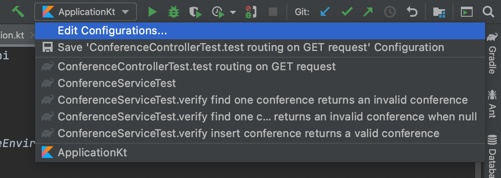
</p>

Select "environment variables" and add the mongo uri and port number as shown below then hit "apply".

<p align="center">
    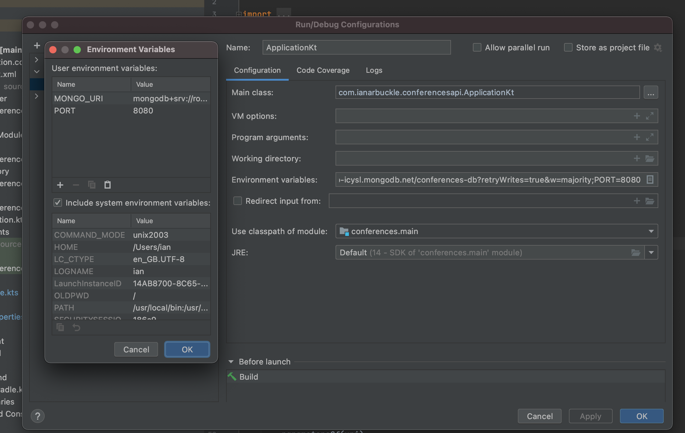
</p>

Go ahead and run our Ktor app and give yourself a good pat on the back!

## Testing our requests with Postman 

Postman is an API client that allows us to develop create, share and test APIs easier.

If you haven't already downloaded Postman, please go to their website and download their desktop app.

Download the [collection](https://www.getpostman.com/collections/48882bc0d6e799c28026) and replace the base url with your own.

## Summary 

A short summary of what we've learnt:

- Creating a MongoDB cloud database with Altas
- Using Ktor with the MongoK library to create our CRUD operations
- Testing our API calls with Postman collection

Code for this tutorial can be found on [github](https://github.com/IanArb/conferencesKtor)

Part 2 of this tutorial will be how to deploy the API using Docker and Heroku.

Thanks for reading!