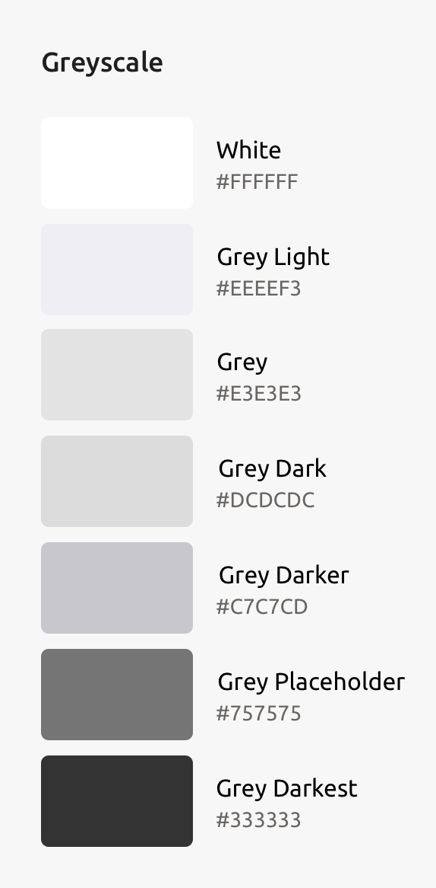
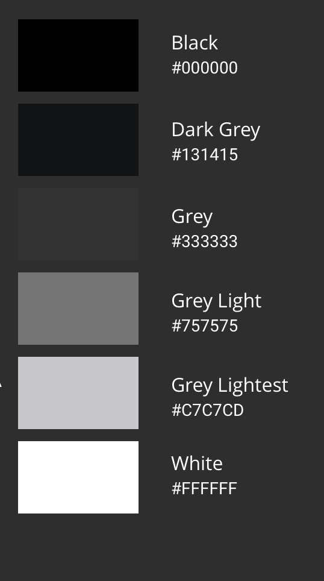
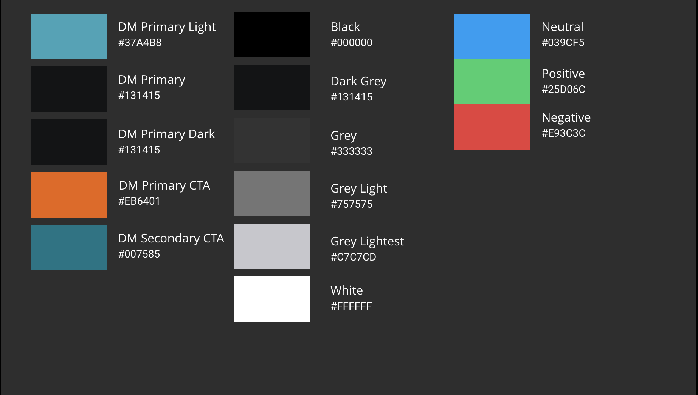
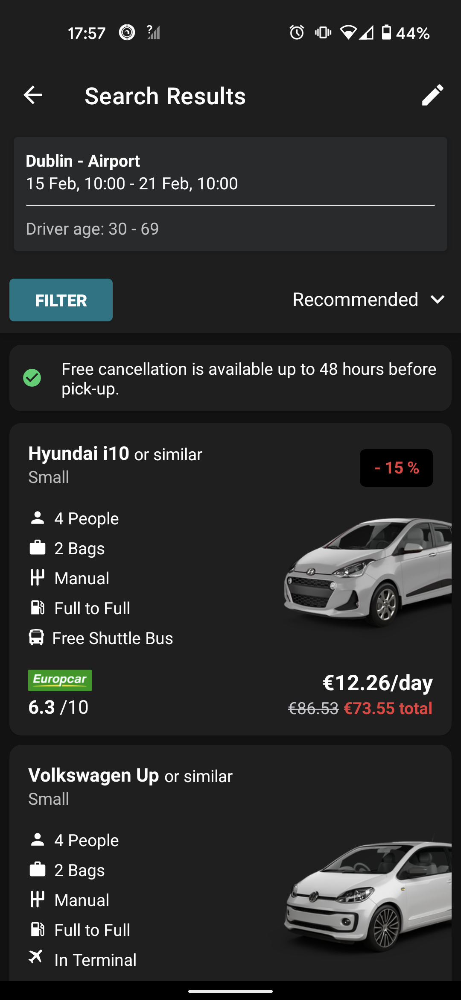
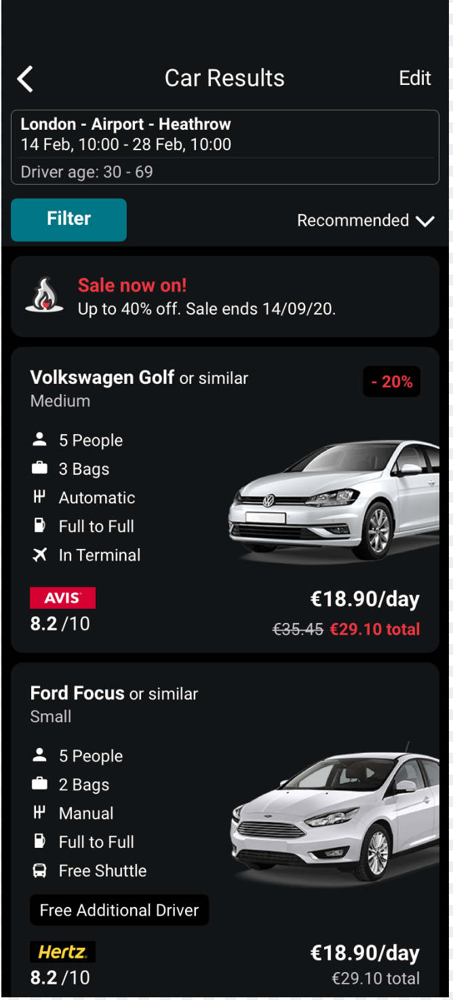

This blog post will share my experience working with designers on how to bring the best experience for your platform, whether it is Android or iOS.

Dark mode support is becoming a popular feature and almost every customer and business stakeholder is asking for it. Rightly so, the big advantage of implementing dark mode on your mobile apps is the battery saving consumption for our users. The more battery life, the happier the user! It also brings an aesthetic option to our users who may prefer darker colours. For instance, a user may have sensitivity to bright light colours. By implementing dark mode, we are making our mobile apps more accessible to users with sensitive eyesight. 

Your first instinct might be just to read the documentation on the respective platform and implement the feature as you go. We can get away with that on our side projects but maybe not so on real projects. In most projects, you will have a designer and communication will be key. Both platforms implement dark mode differently and I'll outline the approaches you could take before getting your hands dirty.

## Colour Palettes

We should start reviewing the mobile app's colour palette. In our case, we had numerous variants of colours on the greyscale hardcoded in the Android and iOS codebase. This presented a bottleneck on preparing our app to dark mode. Firstly, do review your existing colour palette as this will make a smooth transition. In our case, we standardised our greyscale palette in the light variant which allowed us to easily swap this to our dark mode variant.

Here our examples of how we transformed our greyscale. 

Light greyscale

<p align="center">
    
</p>

<small>From [https://cartrawler.invisionapp.com/share/FGQ4MIYEJ5P#/screens/342569480](https://cartrawler.invisionapp.com/share/FGQ4MIYEJ5P#/screens/342569480) </small>

Dark greyscale

<p align="center">
    
</p>

<small>From [https://cartrawler.invisionapp.com/share/FGQ4MIYEJ5P#/screens/342569480](https://cartrawler.invisionapp.com/share/FGQ4MIYEJ5P#/screens/342569480) </small>

### Promote your app's brand in dark mode

Once we consolidated our greyscale we moved onto our branding colours. In terms of dark mode, mostly everything is dark. However, you can still promote your app's brand by making good use of your secondary colours and primary colour variants. 

An example of our dark theme branding colours:

<p align="center">
    
</p>

<small>From [https://cartrawler.invisionapp.com/share/FGQ4MIYEJ5P#/screens/342569480](https://cartrawler.invisionapp.com/share/FGQ4MIYEJ5P#/screens/342569480) </small>

### Use system defined attributes
In Android, we use the attributes defined by the Material Components Themes. The full color theming guide can be found from the material components theme [documentation](https://material.io/develop/android/theming/color)

We can then simply setup our dark theme by inheriting the ```.DayNight``` theme as follows:

````xml
<style name="Theme.MyApp" parent="Theme.MaterialComponents.DayNight">
    <!-- ... -->
</style>
````

In our case, we needed to be able to override some color resources in night theme. In order to do this, we create a value folder called ``value-night`` directory with our defined night theme. This enabled us to easily facilitate changes in both our light and dark themes.

On iOS side, they needed to remove any hardcoded color values that don't adapt to the [dynamic system colors](https://developer.apple.com/design/human-interface-guidelines/ios/visual-design/color/#dynamic-system-colors). iOS had a few custom components that needed to be migrated to the dynamic system colours. Otherwise, we will run into issues if something changes from release to release.

>Instead of trying to create custom colors that match the system colors, use the dynamic system colors.

<small>From [https://developer.apple.com/design/human-interface-guidelines/ios/visual-design/color/#dynamic-system-colors](https://developer.apple.com/design/human-interface-guidelines/ios/visual-design/color/#dynamic-system-colors) </small>

## Material Design vs Human Interface Guidelines

Android uses [Material Design](https://material.io/) whereas iOS follows [Human Interface Guidelines](https://developer.apple.com/design/human-interface-guidelines/). For a designer, this is extremely important to notice any subtle UI differences from both design guidelines. If you have a designer who prefers to implement iOS designs and tells you to just "copy" it for Android. That habit needs to stop when it comes to implementing dark mode. Otherwise, we'll be sacrificing good user experience on one platform. On top of all that, frustrated Android developers ;)

In Android, we use elevation for cards, banners or bottom sheet components. In dark theme, the behaviour is slightly different.

>As a surface raises in elevation, it becomes lighter in color.

<small>From [https://material.io/design/color/dark-theme.html#properties](https://material.io/design/color/dark-theme.html#properties) </small>

#### Android

<p align="center">
    
</p>

In this example, we decided to increase the elevation for the edit search card to let the user know that it can be interacted with. The car block elevation has been set to the default elevation. In contrast to our light theme, the card becomes lighter in colour when we increase the elevation.

#### iOS

<p align="center">
    
</p>

In iOS we decided to highlight the edit search card with a white border. The car block card itself is darker in colour in comparison to Android, which opts for a lighter dark.

In iOS, elevation isn't used to support visual cues for separation between surfaces. When implementing dark mode, this would be one of main subtle UI differences. This highlights the importance of following the platform's design patterns. This will enable us to deliver a consistent and good dark mode experience for our users on both platforms.

## Design Reviews

Doing a design review or if you prefer to call them design QAs, is the most important process to delivering a fully polished dark mode feature. To make the design reviews less tedious and long, I recommend you to follow these steps:

1. <strong>Keep it small</strong>

    Ask your designers to only review screen by screen. The last thing you want is a massive design feedback for the entire feature! By keeping it small, you can tackle the design feedback in smaller pieces and build your way through it. This saves yourself time and of course, helps your designers.

2. <strong>Keep the behaviour consistent to the platform</strong>

    Since Android uses elevation for surface raise on cards for example, whereas iOS may opt for a slightly light dark surface instead. Both platforms UIs have subtle differences and communicating this with a designer is key. 

3. <strong>Don't take it personal</strong>

    Design reviews are not to be used as a platform to nick pick your work. They allow a designer to ensure that the work you implemented matches what they've designed. Just remember, this is as much as their work as is yours.

Most importantly, the road to a good user experience is behind a good design review.

## Conclusion

To implement an excellent user experience for dark mode is no easy task and especially on mobile. There were lots of things we learned from how other apps have done it and how to avoid the same mistakes they did. Although, there will be improvements as we learn more about how our users use it. It is still very early days until we all get it right.

From the developers perspective it provides the opportunity for us to learn about our existing design system in the codebase. It allows us to think about refactoring our design system to accommodate easy changes in the future. 

To end with a Star Wars quote:

>“Once you start down the dark path, forever will it dominate your destiny.”
