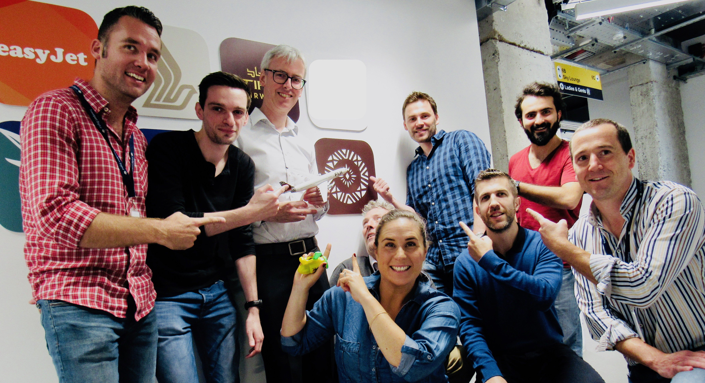

    

    I'm an Android developer currently working at <a href="https://www.cartrawler.com/ct/">CarTrawler</a>

## What I do

At CarTrawler I'm working on unlocking mobile as one of its core strategic pillars. My role is delivering our Car Rental white label Android SDK for our airline and TMCs partners. We surface our Car Rental SDK in airline apps that enables users to rent cars via their favourite airline app such as easyJet and Norwegian to name just a few.

<h3 id="tasksList">My daily responsibilities include:</h3>

<ul>
    <li>Developing rich features that improve the booking experience for our users</li>
    <li>Improving our Android architecture using MVVM and utilising clean architecture principles</li>
    <li>Adopting CI/CD to increase quality and speed of delivery for our SDK</li>
    <li>Updating supporting documentation for SDK integration and providing technical support to partners</li>
</ul>

<h3 id="customersList">Some of our customers</h3>
<ul>
    <li>easyJet</li>
    <li>Norwegian Air Shuttle</li>
    <li>eDreams ODIGEO</li>
    <li>Travelstart</li>
    <li>Finn.no</li>
</ul>

## Background

I'm from Dublin, Ireland. I previously played hurling since I was 10 years old for St Vincents GAA club. Even back then, hurling was not hugely popular in the capital as opposed to Gaelic football. This is where I learnt team ethics, hard work and of course, bravery!

This video below best demonstrates our beautiful game.
<iframe width="560" height="315" src="https://www.youtube.com/embed/TmzivRetelE" frameborder="0" allow="accelerometer; autoplay; clipboard-write; encrypted-media; gyroscope; picture-in-picture" allowfullscreen></iframe>

Fast forward a couple of years, I graduated from [National College of Ireland](https://www.ncirl.ie/) in Computer Science and started to work for [Travelport Digital](https://digital.travelport.com/) (previously known as Mobile Travel Technologies) as an Android developer. 

During my time at Travelport Digital, I had the opportunity to work as an intern on delivering the first native Etihad Airways Android app. This is when my Android journey began and brought valuable skills such as; customer facing communication, scrum methodology, microservices architecture and of course, developing features in Android.  

While I finished up my degree at NCI, I rejoined Travelport Digital with the opportunity to work on the white label airline app, Fusion. This was my first experience working in product. I delivered features for check-in, interactive seat maps, and mobile boarding passes. I was also one of the first developers to be part of the team that on-boarded the first Fusion customer, Fiji Airways.

    
    <small>Fiji Android and iOS apps launch</small>

After an amazing 2 and a half years at Travelport Digital, I got the opportunity to join CarTrawler to help them unlock their mobile strategy. This also provides another opportunity to explore another area in travel industry, car rental and mobility.

